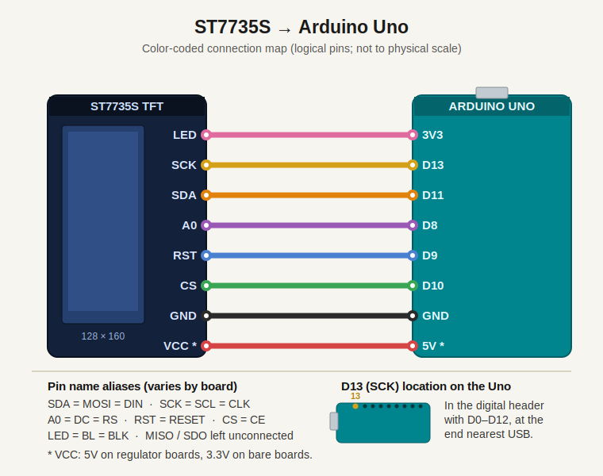
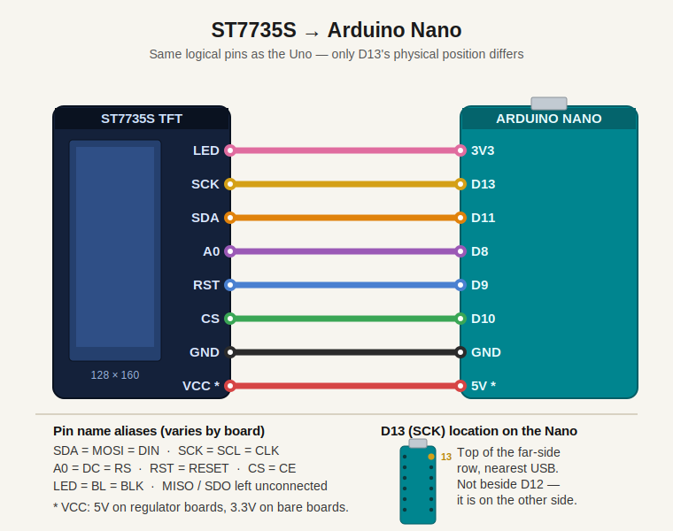

# Bot Notifier

<p align="center">
  
</p>

A pixel-art robot on a small TFT display, driven by an Arduino Nano, that shows the state of a Claude Code session running on your computer. Your machine pushes one-line status messages over USB serial; the bot changes its facial expression and color, flashing red when Claude Code needs your attention.

The board cannot poll the computer, so communication is one-directional: the computer writes, the firmware reads and reacts.

## Hardware

- Arduino Nano (ATmega328P) — an Uno works identically.
- ST7735S TFT, 1.8" 128x160, SPI.
- Jumper wires. Optionally a logic level shifter (see the Logic level section).
- USB cable to the computer.

## Wiring the display

The wiring is identical on the Arduino Uno and the Arduino Nano: the firmware drives the same pins on both boards. The only physical difference is where the `SCK` pin (D13) sits — see the per-board notes below.

**Arduino Uno**



**Arduino Nano**



### Connections

| ST7735S pin | Arduino pin (Uno & Nano) | Note |
|---|---|---|
| VCC | 5V (regulator board) or 3.3V (bare) | check your board |
| GND | GND | shared with the Arduino |
| CS | D10 | configurable in firmware |
| RESET / RST | D9 | configurable |
| A0 / DC / RS | D8 | configurable |
| SDA / MOSI | D11 | hardware SPI, fixed |
| SCK | D13 | hardware SPI, fixed |
| LED / BL | 3.3V | most boards have a series resistor onboard |

`SCK` and `MOSI` are fixed hardware-SPI pins. `CS`, `RESET`, and `A0/DC` are defined in the firmware and can be changed.

### Pin labels

Cheap boards silkscreen the same pins under different names:

- `SDA` = `MOSI` = `DIN` → MOSI
- `SCK` = `SCL` = `CLK` → SCK
- `A0` = `DC` = `RS` → Data/Command
- `RESET` = `RST`
- `CS` = `CE` → Chip Select
- `LED` = `BL` = `BLK` → Backlight
- `MISO` / `SDO` → leave unconnected

### Logic level

The ST7735S controller runs at **3.3V logic**; the Uno and Nano output **5V logic**.

- Boards with an onboard AMS1117 regulator (most 1.8" red/black PCBs): `VCC` accepts 5V, but the SPI/control lines still feed the 3.3V controller directly. Driving them at 5V usually works but is out of spec.
- Bare boards without a regulator: `VCC` must be **3.3V only**.

Safe option on a 5V board: put a level shifter (or 1kΩ series + 2kΩ-to-GND dividers) on the lines going *into* the display — SCK, MOSI, CS, DC, RST. The display sends nothing back, so MISO is unused. Many people wire directly on a regulator board and accept the risk.

### Finding D13 (SCK)

- **Uno:** D13 is in the digital header alongside D0–D12, at the end nearest the USB connector.
- **Nano:** D13 is *not* next to D12. D2–D12 run down one long side; D13 sits at the top of the *other* side (the row with A0–A7 and 3V3), nearest the USB connector. It may be silkscreened `D13`, `13`, or `SCK`. The 2x3 ICSP header near the USB end also exposes SCK/MOSI.

SCK is fixed to D13 in hardware; it cannot be moved to D12 without switching to slower software SPI.

### Backlight

If there is no current-limiting resistor near the LED pin, add ~50–100Ω in series. Connecting LED to 3.3V is the safe default.

## States and expressions

The screen is a pet-card UI: a **PET BOT** header with the current action (IDLE / BUSY / READY / ATTENTION / ERROR, color-coded), a big floating face (smooth tweened RoboEyes + a curvy mouth) over a starfield, a middle panel with the mood word and the last message you sent from the terminal (amber, prefixed `>`), and a bottom speech bubble where the bot talks with its own per-expression phrases.

| Command | State | Face / card | Bot phrase |
|---|---|---|---|
| `!` | Attention | Wide startled eyes, gentle shake, red `O` mouth, red flashing border, `ALERT!` | `Human needed here!` |
| `>` | Busy | Eyes scan left–right, amber talking mouth, `WORKING` | `Crunching bits...` |
| `=` | Ready | Happy eyes + laugh bounce, green grin, `HAPPY` | `Done! Your turn!` |
| `x` | Error | Angry lids frozen, red zigzag mouth, `ERROR` | `Ouch! Hit an error.` |
| `.` | Idle | Cycles moods (7–11 s each): `CALM` (smile), `CURIOUS` (wandering eyes), `HAPPY` (grin), `THINKING` (looks up + animated `...`), `BORED` (suspicious lids, slow side glances), `SLEEPY` (tired lids, looks down) | per mood, e.g. `Zzz... zzz... zzz` |

Each command is followed by optional text shown in the message bar at the bottom of the screen (max 21 characters).

## Files

- `bot_notifier/bot_notifier.ino` — Arduino firmware (Arduino IDE opens the folder as a sketch).
- `bot_notifier/RoboEyes_TFT.h` — FluxGarage RoboEyes V1.1.1 ported to framebuffer-less TFTs (dirty-rect rendering, 16-bit colors, drawing origin, new `SUSPICIOUS` mood; GPL-3.0).
- `bot_notifier/RoboMouth_TFT.h` — small curvy mouth shapes (GFX arc helpers): flat, smile, frown, grin, `O`, smirk, zigzag, animated talk, animated thinking dots.
- `demon/demon.py` — serial daemon; holds the port open and forwards messages.
- `demon/frog-demon.sh` — Claude Code hook script; translates hook events into bot commands.
- `assets/wiring-uno.svg`, `assets/wiring-nano.svg` — wiring diagrams shown above.
- `settings.json` — the hook block to merge into `~/.claude/settings.json`.

## Firmware installation

1. Install the display libraries. Arduino IDE → Tools → Manage Libraries → search `Adafruit ST7735` → install **Adafruit ST7735 and ST7789 Library**. Accept the prompt to install dependencies (**Adafruit GFX Library**, **Adafruit BusIO**). If no prompt appears, install `Adafruit GFX` and `Adafruit BusIO` manually. `Adafruit_GFX.h` lives in the GFX library — that is the header the compiler needs.
2. Confirm library location if a `No such file or directory` error persists: File → Preferences → "Sketchbook location" contains a `libraries` folder where `Adafruit_GFX_Library`, `Adafruit_ST7735_and_ST7789_Library`, and `Adafruit_BusIO` must appear as directories.
3. Open `bot_notifier/bot_notifier.ino`.
4. Tools → Board → **Arduino Nano** (or Arduino Uno). On older Nano clones, Tools → Processor → **ATmega328P (Old Bootloader)**.
5. Tools → Port → select the Nano's serial port.
6. Upload.

If the screen shows nothing or looks wrong after upload, see Troubleshooting.

## Protocol

One line per message. The first character is the command; the rest is the message text.

```
! approve rm -rf node_modules?
> building portal
= tests passed
x build failed
.
```

Serial runs at **115200 baud**. Text is truncated to 21 characters on screen.

## Daemon installation

The Nano reboots whenever its serial port is opened (DTR toggles auto-reset). If every message opened the port, the board would reset on every Claude Code hook. The daemon opens the port **once** and stays connected; your terminal and the hooks write to a named pipe (FIFO) that the daemon forwards. No hardware modification is required. If the board is unplugged, the daemon waits and reconnects when it reappears.

Install pyserial:

```bash
pip3 install pyserial
```

Run the daemon (leave it running):

```bash
python3 demon/demon.py &
```

It auto-detects common USB-serial device names. If it picks the wrong one, find the device with `ls /dev/cu.*` and set it explicitly:

```bash
DEMON_PORT=/dev/cu.wchusbserial14230 python3 demon/demon.py &
```

The pipe path defaults to `/tmp/demon.pipe`; override with `DEMON_PIPE` if needed.

## Terminal usage

With the daemon running, write lines to the pipe. All five commands, with the Claude Code hook that triggers each one automatically:

```bash
echo "! approve this?"   > /tmp/demon.pipe  # ATTENTION — wide eyes, O mouth, flashing red border  (hook: Notification)
echo "> building app"    > /tmp/demon.pipe  # BUSY — scanning eyes, flat mouth, amber WORKING...   (hook: UserPromptSubmit)
echo "= tests passed"    > /tmp/demon.pipe  # READY — happy ^ ^ eyes, big grin, green YOUR TURN    (hook: Stop / SubagentStop)
echo "x build failed"    > /tmp/demon.pipe  # ERROR — red x x eyes, frown, still                   (manual only)
echo "."                 > /tmp/demon.pipe  # IDLE — wandering eyes, small smile, blinks           (hook: SessionStart)
```

Text after the command character is optional and shows in the message bar (truncated to 21 characters).

Writing to the pipe from a plain shell when no reader is connected will block the terminal until a reader appears. That blocking is the signal that the daemon is not running. (The Claude Code hook script is immune: it opens the pipe non-blocking and drops the message silently if no daemon is listening.)

## Claude Code integration

Save the hook script as `~/bin/frog-demon.sh` and make it executable:

```bash
chmod +x ~/bin/frog-demon.sh
```

Add the hooks to `~/.claude/settings.json` (same content as `settings.json` in this repo):

```json
{
  "hooks": {
    "Notification":     [ { "hooks": [ { "type": "command", "command": "~/bin/frog-demon.sh '!'" } ] } ],
    "UserPromptSubmit": [ { "hooks": [ { "type": "command", "command": "~/bin/frog-demon.sh '>'" } ] } ],
    "Stop":             [ { "hooks": [ { "type": "command", "command": "~/bin/frog-demon.sh '='" } ] } ],
    "SubagentStop":     [ { "hooks": [ { "type": "command", "command": "~/bin/frog-demon.sh '='" } ] } ],
    "SessionStart":     [ { "hooks": [ { "type": "command", "command": "~/bin/frog-demon.sh '.'" } ] } ]
  }
}
```

- `Notification` fires when Claude Code needs permission for a tool or is idle waiting on you — this drives the flashing-red attention state.
- `UserPromptSubmit` marks the bot busy.
- `Stop` / `SubagentStop` mark your turn.
- `SessionStart` resets to idle.

Hook event names and the stdin JSON field names change between Claude Code releases. Verify them against your installed version; the `message` / `prompt` keys the script reads must match what your version emits.

## Startup order

1. Flash the firmware.
2. Start `demon/demon.py`.
3. Confirm a manual `echo "= hi" > /tmp/demon.pipe` makes the bot grin.
4. Restart your Claude Code session so it reloads `settings.json`.

## Test button (optional)

Wire a push button between **D3 and GND** (the firmware uses the internal pull-up; no resistor needed). Each press cycles through the five states in sequence — idle → busy → ready → attention → error — through the same code path as serial messages, with a sample message each. Idle expressions keep cycling on their own while idle. No button connected = pin stays high, nothing happens.

## Stopping the daemon

Foreground (holding the terminal): `Ctrl-C`.

Backgrounded with `&` in the current shell: `kill %1` (check the job number with `jobs`).

From any other terminal, by name:

```bash
pkill -f demon.py
```

`-f` matches the full command line because the process name is `python3`, not `demon.py`. Confirm it is gone:

```bash
pgrep -f demon.py    # no output means it is dead
```

If it ignores a normal kill:

```bash
pkill -9 -f demon.py
```

The FIFO at `/tmp/demon.pipe` persists after the daemon exits and is harmless. Remove it if you want:

```bash
rm -f /tmp/demon.pipe
```

## Troubleshooting

- **`Adafruit_GFX.h: No such file or directory`** — GFX library not installed or installed outside the sketchbook `libraries` folder. See Firmware installation steps 1–2.
- **Blank white screen, backlight on** — wrong init constant. In `setup()`, replace `INITR_BLACKTAB` with `INITR_GREENTAB`, then `INITR_REDTAB`.
- **Colors inverted or red/blue swapped** — add `tft.invertDisplay(true);` after init, or change the tab constant.
- **Image shifted a few pixels at the edges** — green-vs-black tab mismatch; change the tab constant.
- **Random noise / garbage** — SCK or MOSI miswired, RST floating, or 5V feeding a bare 3.3V board.
- **Nothing at all, backlight off** — VCC or LED pin not powered; confirm GND is shared with the Nano.
- **Works intermittently** — long jumper wires degrade SPI; shorten them.
- **`demon: no serial port found`** — set `DEMON_PORT` explicitly (`ls /dev/cu.*`).
- **Terminal hangs on `echo ... > /tmp/demon.pipe`** — the daemon is not running; start it.
- **Bot does not react to Claude Code** — restart the Claude session after editing `settings.json`; verify hook event names for your version.

## Tuning (firmware)

- Layout: `EYES_X/Y/W/H` (eyes' sub-region inside the face screen), `MOUTH_CX/CY`; body/panels are drawn in `drawStaticUI()`.
- Eye look: `resetFace()` sets size (11x14 ovals), border radius, spacing, auto-blink cadence.
- Idle personality: `IDLE_SCENES[]` (`{duration_ms, scene}`) plus the parallel `SCENE_MOOD` / `SCENE_ENERGY` / `SCENE_MSG` tables. Per-state equivalents in `STATE_MOOD` / `STATE_MSG`.
- Per-state faces are configured in `enterState()`; continuous gaze animation (scanning, impatient glances, attention shakes) in `tickState()`.
- Shake intensity: `flickerStepMs` (toggle cadence, default 70 ms) and the amplitudes in `anim_confused` (4 px) / `anim_laugh` (2 px) inside `RoboEyes_TFT.h`.
- Eyes API (RoboEyes_TFT.h): `setMood(DEFAULT/TIRED/ANGRY/HAPPY/SUSPICIOUS)`, `setPosition(N/NE/E/SE/S/SW/W/NW/DEFAULT)`, `setIdleMode`, `setCuriosity`, `anim_laugh()`, `anim_confused()`, `setAutoblinker`, H/V flicker.
- Mouth API (RoboMouth_TFT.h): `setShape(MOUTH_FLAT/SMILE/FROWN/GRIN/O/SMIRK/ZIGZAG/TALK/DOTS)`, `setColor`; `talkInterval`/`dotsInterval` tune the animated shapes.
- Colors: `C_BG` (dark navy), `C_RED`, `C_AMBER`, `C_GREEN`, `C_WHITE`, `C_CYAN`.

No framebuffer needed: both libraries erase only the strips of the previous frame that the new frame no longer covers, so rendering is flicker-free.

## SHORT DEMO


https://github.com/user-attachments/assets/7aa83274-c571-4e20-a0ab-c7a5254650d3


https://github.com/user-attachments/assets/5a21ff18-1aad-4d5a-b1a1-079eb418dd48

